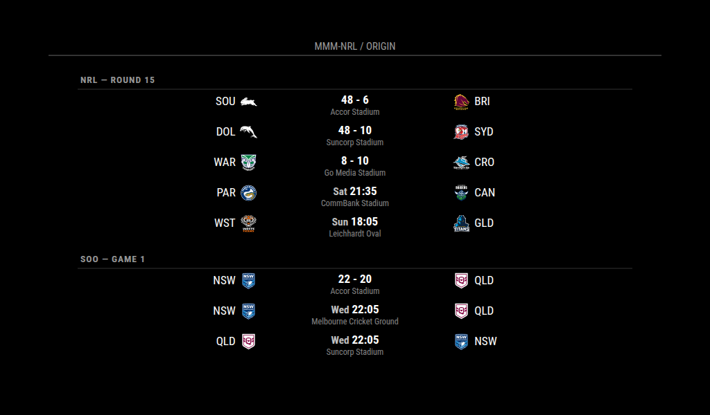

# MMM-NRL

A MagicMirror² module for displaying NRL (National Rugby League) match scores and information.

## Installation

1. Navigate to your MagicMirror's modules folder:
```bash
cd ~/MagicMirror/modules
```

2. Clone this repository:
```bash
git clone https://github.com/EwwYumYuck/MMM-NRL
```

3. Install dependencies:
```bash
cd MMM-NRL
npm install
```

## Configuration

Add the following configuration to your `config/config.js` file:

```javascript
{
    module: "MMM-NRL",
    position: "top_right",
    config: {
        header: "NRL Matches",         // Optional: Set to null to hide header
        updateInterval: 300000,        // 5 minutes for regular updates
        updateIntervalLive: 60000,     // 1 minute for live games
        animationSpeed: 1000,
        showLogos: true,
        showScores: true,
        showTime: true,
        showVenue: true,
        colored: true,                 // false for grayscale logos
        maximumEntries: 10,
        focus_on: false,              // Set to team name to focus on specific team
        mode: "all",                  // "all", "live", "upcoming", or "completed"
        useAbbreviations: true,       // Use team abbreviations (e.g., MEL, BRI)
        competitions: ["nrl"],        // Add "nrlw", "soo", "wsoo" for more competitions
        showCompetition: false        // Show competition label (e.g., NRLW | venue - round)
    }
}
```

### Configuration Options

| Option             | Description                                                                                    | Default |
|--------------------|------------------------------------------------------------------------------------------------|---------|
| header             | Text to display in the header. Set to null to hide header                                      | "NRL Matches" |
| updateInterval     | How often to fetch new data for regular updates (in milliseconds)                              | 300000 (5 minutes) |
| updateIntervalLive | How often to fetch new data during live games (in milliseconds)                                | 60000 (1 minute) |
| animationSpeed     | Speed of the update animation (in milliseconds)                                                | 1000 |
| showLogos          | Whether to show team logos                                                                     | true |
| showScores         | Whether to show match scores                                                                   | true |
| showTime           | Whether to show match time                                                                     | true |
| showVenue          | Whether to show match venue                                                                    | true |
| colored            | Whether to show colored logos (false for grayscale)                                            | true |
| maximumEntries     | Maximum number of matches to display                                                           | 10 |
| focus_on           | Team name to focus on (e.g., "Storm", "Broncos"). Set to false to show all teams              | false |
| mode               | Display mode: "all", "live", "upcoming", or "completed"                                        | "all" |
| useAbbreviations   | Use team abbreviations instead of full names                                                   | true |
| competitions       | Array of competitions to display: "nrl", "nrlw", "soo", "wsoo"                               | ["nrl"] |
| showCompetition    | Show competition label in venue row (e.g., NRLW \| Accor Stadium - Round 1)                  | false |

### Team Abbreviations

When `useAbbreviations` is enabled, the following abbreviations are used:

#### NRL Premiership

| Team | Abbreviation |
|------|--------------|
| Broncos | BRI |
| Bulldogs | CBY |
| Cowboys | NQL |
| Dolphins | DOL |
| Dragons | STI |
| Eels | PAR |
| Knights | NEW |
| Panthers | PEN |
| Rabbitohs | SOU |
| Raiders | CAN |
| Roosters | SYD |
| Sea Eagles | MAN |
| Sharks | CRO |
| Storm | MEL |
| Titans | GLD |
| Warriors | WAR |
| Wests Tigers | WST |

#### NRLW — Women's Premiership

NRLW teams share the same names and abbreviations as their NRL counterparts above.

#### State of Origin

| Team | Abbreviation |
|------|--------------|
| Blues | NSW |
| Maroons | QLD |

#### Expansion Teams

| Team | Abbreviation |
|------|--------------|
| Perth | PER |
| Chiefs | PNG |

## Multi-Competition Usage

You can display multiple competitions at once by setting the `competitions` array. Each competition pulls from the NRL draw API independently and results are merged and sorted by date.

Available competition values:

| Value | Competition |
|-------|-------------|
| `"nrl"` | NRL Premiership (men's) — default |
| `"nrlw"` | NRL Women's Premiership |
| `"soo"` | Ampol State of Origin (men's) |
| `"wsoo"` | Ampol Women's State of Origin |

Example — show NRL, NRLW and State of Origin together:

```javascript
{
    module: "MMM-NRL",
    position: "top_right",
    config: {
        competitions: ["nrl", "nrlw", "soo"],
        showCompetition: true,
        header: "NRL / NRLW / Origin"
    }
}
```

With `showCompetition: true` the venue row shows which competition each match belongs to:
```
NRLW | Cbus Super Stadium - Round 1
SOO  | Accor Stadium - Game 2
```

## Features

- Multi-competition display — NRL, NRLW, State of Origin (men's and women's)
- Live match scores and updates
- Team logos (colored or grayscale)
- Match venues and round information
- Configurable update intervals (faster updates during live games)
- Filter matches by team or status
- Competition label display to distinguish NRL from NRLW and SoO
- Team name abbreviations (e.g., MEL, BRI, WAR)
- Clean and modern design
- Customizable header text
- Automatic live game detection for faster updates
- Perth Bears (2027) and PNG Chiefs (2027+) pre-wired — logos and abbreviations ready, will display automatically when the NRL API includes them

## Screenshots



## Updating

To update the module to the latest version:

```bash
cd ~/MagicMirror/modules/MMM-NRL
git pull
npm install
```

## Contributing

Feel free to submit issues and pull requests!

## Updates

- Multi-competition support added: NRLW, State of Origin (men's and women's)
- Perth Bears (2027) and PNG Chiefs (2027+) pre-wired — will appear automatically when NRL API includes them

## License

This project is licensed under the MIT License - see the LICENSE file for details.
